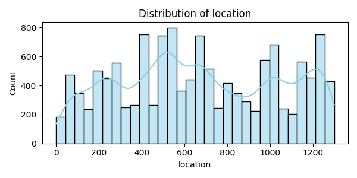

# 🏠 Bangalore House Price Prediction

A data science project that predicts house prices in Bangalore using machine learning techniques. This end-to-end project includes data cleaning, feature engineering, model training (Decision Tree Regressor), and rich visualizations through Power BI and Tableau.

## 📊 Project Overview

- 📍 **Location Focus**: Bangalore, India  
- 🎯 **Goal**: Accurately predict house prices based on features such as location, size, number of bathrooms, and more  
- 🧠 **ML Algorithm**: Decision Tree Regressor  
- 📈 **Visualization**: Power BI & Tableau dashboards for interactive data exploration

---

## 🛠 Tech Stack

- **Python** – pandas, numpy, scikit-learn, seaborn, matplotlib
- **Jupyter Notebook** – for data analysis and model building
- **Power BI** – interactive dashboards for business insights
- **Tableau** – visual storytelling and comparative dashboards
- **Excel** – for data inspection and basic EDA

---

